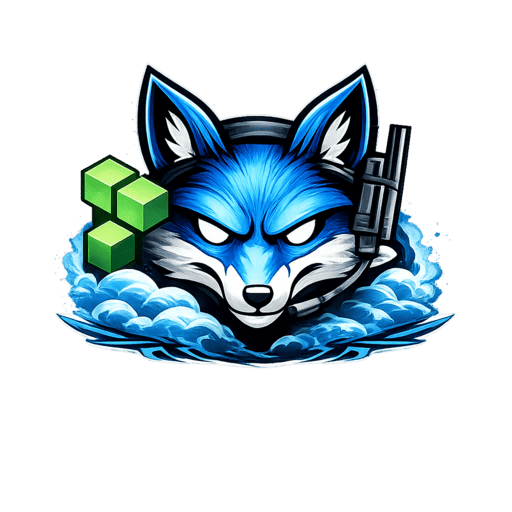

# AzureFox OpenTofu Proof Lab

<p align="center">
  
</p>

This repo contains the OpenTofu lab environment for AzureFox.

It creates a small Azure footprint that you can deploy in a disposable subscription, run AzureFox
against, and use for demos, validation runs, and proof-of-capability testing.

Unlike the main AzureFox repo, this one is meant to stay hands-on and easy to inspect. The goal is
to make the lab behavior obvious rather than hiding it behind extra packaging.

## Companion Repo

This lab belongs with the main AzureFox project:

- Main repo: [TacoRocket/AzureFox](https://github.com/TacoRocket/AzureFox)

Use this repo to deploy and validate the lab environment. Use the main AzureFox repo for the CLI,
command implementation, and release source of truth.

## What This Repo Is For

- give AzureFox a real Azure target for demos and validation runs
- exercise the current AzureFox command set against live infrastructure
- provide a repeatable OpenTofu deployment and teardown flow
- generate validation artifacts that show AzureFox findings against known lab conditions

## AzureFox Coverage

The lab is built to exercise this release-gated subset of AzureFox standalone commands. AzureFox
may have additional commands on `main` that are still discovery-only or not yet backed by
deterministic lab proof objects.

Current validator coverage:

- `whoami`
- `inventory`
- `automation`
- `devops`
- `arm-deployments`
- `env-vars`
- `tokens-credentials`
- `rbac`
- `principals`
- `permissions`
- `privesc`
- `role-trusts`
- `lighthouse`
- `cross-tenant`
- `resource-trusts`
- `auth-policies`
- `managed-identities`
- `keyvault`
- `storage`
- `vms`
- `vmss`
- `nics`
- `dns`
- `endpoints`
- `network-ports`
- `network-effective`
- `workloads`
- `app-services`
- `functions`
- `api-mgmt`
- `aks`
- `acr`
- `databases`
- `snapshots-disks`

Optional grouped follow-up:

- `chains credential-path`
- `chains deployment-path`
- `chains escalation-path`

The project is OpenTofu-first, but the HCL stays close to standard Terraform style so it feels
familiar to most operators.

Current checkpoint notes:

- `docs/activity-log-bundles.md`
- `docs/live-run-strategy.md`
- `docs/phase2-secrets-config-resource-checkpoint.md`
- `docs/phase3-compute-apps-network-checkpoint.md`
- `docs/phase4-command-discovery-checkpoint.md`

Current release boundary:

- this repo now targets AzureFox `1.3.0` as the current parity boundary
- deterministic lab-backed proof now includes `snapshots-disks`, `vmss`, and one Automation account
- `lighthouse` and `cross-tenant` are validated as evidence-led tenant surfaces rather than fixed row-count proof
- `devops` is validated conditionally: without `AZUREFOX_DEVOPS_ORG`, the validator expects the truthful missing-organization issue instead of pretending pipeline coverage exists
- grouped `chains` follow-up remains optional here; Firefox/AzureFox `1.3.0` added more live-proof-aware `credential-path` wording, but this lab still treats grouped chain output as secondary to the standalone validation gate

## Lab Shape

- Four resource groups: `rg-network`, `rg-data`, `rg-workload`, and `rg-ops`
- One VNet with a workload subnet and a private-endpoint subnet
- One public Linux VM named `vm-web-01`
- One Linux VM scale set named `vmss-api`
- One user-assigned managed identity named `ua-app`
- Two app registrations plus backing service principals for role-trusts validation:
  `af-roletrust-api` and `af-roletrust-client`
- One federated identity credential on `af-roletrust-api`
- One internal app-role assignment from `af-roletrust-client` to `af-roletrust-api`
- Low-impact `Reader` RBAC assignments that make the service principals visible to AzureFox
- One storage account that allows public blob access and uses firewall default action `Allow`
- One storage account with firewall default action `Deny` plus a private endpoint
- One public blob container that hosts linked ARM template and parameter artifacts
- Four Key Vaults that cover:
  public network open
  public network enabled with firewall deny
  public network plus private endpoint
  private endpoint only
- One Linux App Service with a system-assigned identity and a plain-text sensitive setting
- One Linux Function App with system-assigned plus user-assigned identity and a Key Vault-backed app setting
- One Linux App Service with attached identity and empty app settings
- One subnet-level NSG allow rule on the workload subnet so `network-ports` has explicit public-ingress evidence for the public VM
- One API Management service with a system-assigned identity plus one API, one backend, and one named value
- One AKS cluster with a public control-plane endpoint and system-assigned identity
- One Azure Container Registry with public network access and admin user enabled
- One Azure SQL server with one user database
- One Azure Automation account with a system-assigned identity
- One public DNS zone plus one private DNS zone with a registration-enabled VNet link
- Three deployment-history objects:
  one succeeded subscription deployment with linked template URI
  one succeeded resource-group deployment with linked parameters URI
  one failed resource-group deployment with no outputs
- One subscription-scope `Owner` role assignment for the managed identity

With this setup, AzureFox should surface:

- subscription context from `whoami`
- resource counts and resource types from `inventory`
- deployment history posture and linked-content metadata from `arm-deployments`
- management-plane app setting exposure from `env-vars`
- correlated token and credential surfaces across apps, VMs, and deployments from `tokens-credentials`
- elevated role assignment visibility from `rbac`
- a subscription-visible principal census from `principals`
- high-impact-role triage from `permissions`
- direct-role and public-identity escalation leads from `privesc`
- app ownership, service-principal ownership, federated credential, and app-role trust edges from `role-trusts`
- storage plus Key Vault exposure rows from `resource-trusts`
- managed identity attachment plus a high-severity finding from `managed-identities`
- Key Vault public-network, private-endpoint, and purge-protection posture from `keyvault`
- public storage and open firewall findings from `storage`
- a public VM with an attached identity from `vms`
- one internal VM scale set footprint from `vmss`
- NIC attachment and public-IP references from `nics`
- public IP and Azure-managed hostname visibility from `endpoints`
- NIC-backed public ingress evidence from `network-ports`
- effective public-IP exposure triage from `network-effective`
- a joined compute plus web workload census from `workloads`
- App Service hostname, identity, and posture inventory from `app-services`
- Function App hostname, identity, and deployment-signal inventory from `functions`
- API Management hostname, identity, subscription, named-value, and backend-host depth from `api-mgmt`
- AKS control-plane endpoint, agent-pool count, OIDC posture, and addon visibility from `aks`
- ACR login-server, admin-user, webhook, replication, and policy posture from `acr`
- Azure SQL endpoint, visible user-database inventory, and minimal TLS posture from `databases`
- Azure Automation account identity and zero-object execution posture from `automation`
- managed-disk attachment, network-access, and encryption posture from `snapshots-disks`
- delegated-management evidence from `lighthouse` when the subscription exposes it
- outside-tenant trust evidence from `cross-tenant` without turning ambient tenant posture into a deterministic row-count claim
- Azure DevOps pipeline evidence from `devops` only when a real organization is configured
- DNS zone inventory and private-endpoint-backed namespace usage from `dns`
- optional grouped follow-up through AzureFox `chains` families when you want a higher-level review path in addition to the standalone proof artifacts

`auth-policies` is handled a little differently in this repo:

- the validator checks that AzureFox reports readable tenant auth metadata accurately
- the validator records permission-denied or partial-read conditions explicitly
- the lab does not mutate tenant-wide Entra auth policy state during this phase

## Warning

This lab creates risky posture in Azure on purpose:

- public IP exposure
- public blob access
- subscription-scope `Owner` RBAC

Use a throwaway subscription dedicated to testing. Do not deploy this into a shared or
production-adjacent subscription.

This repo can deploy an insecure Azure environment. You are responsible for where and how you run
it, and for any cost, exposure, compromise, data loss, or service impact that follows from using
the lab.

The repo does not change tenant-wide Entra auth controls in this phase. Keep it that way unless the
team explicitly decides the added blast radius and rollback burden are worth it.

## Prerequisites

- [OpenTofu](https://opentofu.org/) installed and available as `tofu`
- Azure CLI installed and available as `az`
- Access to a disposable Azure subscription
- Python 3.11+ for the AzureFox CLI
- An AzureFox checkout available locally
- On Windows 10/11, the built-in PowerShell and OpenSSH client are the recommended shell/tooling path

Recommended local checks:

```bash
tofu version
az version
python3 --version
```

## Authenticate To Azure

AzureFox prefers Azure CLI authentication first, so start there:

```bash
az login
az account set --subscription <subscription-id>
```

OpenTofu will also use the Azure CLI session unless you override authentication with environment variables.

`tofu apply` uses the local `tofu`, `az`, and `python3` executables during deployment history
stamping. OpenTofu passes the needed values to the helper script automatically, so you do not need
to set extra environment variables by hand for that step.

The examples below use Bash unless noted. PowerShell equivalents are shown where the command syntax
differs.

## Configure

Copy the example variable file and replace the SSH public key:

```bash
cp tofu.tfvars.example terraform.tfvars
```

```powershell
Copy-Item tofu.tfvars.example terraform.tfvars
```

Edit `terraform.tfvars` and set:

- `ssh_public_key` with an RSA public key
- `name_prefix` if you want a different globally unique storage name prefix
- optional VM sizing overrides if needed

Current tested fallback defaults:

- `location = "centralus"`
- `vm_size = "Standard_D2s_v3"`
- `vmss_sku = "Standard_D2s_v3"`

Why these are the defaults:

- smaller B-series and other low-cost SKUs may be blocked for new or recently upgraded subscriptions with `NotAvailableForSubscription`
- `Standard_D2s_v3` in `centralus` was validated as available for this lab subscription and uses a family with non-zero default quota in this subscription
- this is a POC-oriented fallback, not the long-term ideal cost profile

Generate a compatible keypair:

```bash
ssh-keygen -t rsa -b 4096 -f ~/.ssh/azurefox_lab_rsa -C "azurefox-lab" -N ""
cat ~/.ssh/azurefox_lab_rsa.pub
```

```powershell
ssh-keygen -t rsa -b 4096 -f $HOME/.ssh/azurefox_lab_rsa -C "azurefox-lab" -N ""
Get-Content $HOME/.ssh/azurefox_lab_rsa.pub
```

## Deploy

```bash
tofu init
tofu plan
tofu apply
```

`tofu apply` also stamps the Phase 2 ARM deployment-history objects through a small Azure CLI
helper after the linked template artifacts exist. It creates one succeeded subscription deployment,
one succeeded resource-group deployment, and one failed resource-group deployment so AzureFox can
validate deployment-history coverage in a live tenant.

Useful outputs after apply:

```bash
tofu output subscription_id
tofu output -json role_trusts_manifest
tofu output -json validation_manifest
```

If you change `outputs.tf` or the manifest expectations after the lab is already deployed, refresh
the OpenTofu state before rerunning validation so `validation_manifest` matches the current branch:

```bash
tofu apply -refresh-only
```

## Validate AzureFox Against The Lab

Install the AzureFox package dependencies in your preferred environment, then run:

```bash
python3 scripts/validate_azurefox_lab.py
```

By default the validator:

- reads `tofu output -json validation_manifest`
- executes AzureFox from `--azurefox-dir`
- runs in `--mode full`, which executes the current release-gated standalone AzureFox command set
- treats that default `--mode full` lane as the admin proof path
- prints progress lines before and after each AzureFox step, including elapsed time and target artifact directories
- records per-command UTC start and finish timestamps plus elapsed duration in `command-timeline.json`
- stores proof artifacts under `proof-artifacts/latest`

Viewpoint-aware validation is now available for the same shared lab:

- `admin` keeps the current broad release gate and should see the fullest lab truth
- `dev` uses a scoped workload `Contributor` service principal and should still return useful workload-facing output without subscription-wide truth
- `lower-privilege` uses a workload `Reader` service principal and should still return honest partial visibility instead of misleading emptiness

Reduced viewpoints intentionally run a smaller command lane:

- `whoami`
- `principals`
- `permissions`
- `managed-identities`
- `workloads`
- `functions`

Those reduced lanes are there to prove honest behavior under narrower footholds, not to replace the admin release gate.

For richer `devops` proof, point AzureFox at a real Azure DevOps organization before you run the validator:

```bash
export AZUREFOX_DEVOPS_ORG=<org-name>
```

Optional flags:

```bash
python3 scripts/validate_azurefox_lab.py \
  --azurefox-dir /path/to/azurefox \
  --artifacts-dir ./proof-artifacts/run-01
```

Useful scoped reruns:

```bash
python3 scripts/validate_azurefox_lab.py --mode commands-only
python3 scripts/validate_azurefox_lab.py --mode full
python3 scripts/validate_azurefox_lab.py --mode full --skip-command role-trusts
python3 scripts/validate_azurefox_lab.py --mode commands-only --viewpoint dev
python3 scripts/validate_azurefox_lab.py --mode commands-only --viewpoint lower-privilege
python3 scripts/validate_azurefox_lab.py --viewpoint all
```

Runtime notes:

- use `--mode full` as the single end-to-end validation run
- `commands-only` is now just an explicit standalone-only rerun alias for the same command family as `full`
- `--viewpoint admin` is the default and preserves the existing release-gated artifact layout
- `--viewpoint dev` and `--viewpoint lower-privilege` require `--mode commands-only`; they use sensitive OpenTofu outputs plus isolated `AZURE_CONFIG_DIR` sessions so the validator does not overwrite the operator's main Azure CLI login
- `--viewpoint all` runs the admin lane plus both reduced viewpoints together and writes reduced-lane artifacts under `proof-artifacts/latest/viewpoints/`
- if the live lab is already up and you only changed outputs or validator expectations, refresh the
  OpenTofu state before rerunning validation so stale `validation_manifest` data does not cause a
  false mismatch
- use `--mode commands-only` when you want the individual command outputs without the orchestration pass
- `role-trusts` can take several minutes because the Azure API path is slow; the validator now emits periodic wait lines during that step instead of appearing hung
- after `role-trusts` has been validated once for the current phase, reruns can use `--skip-command role-trusts` unless you changed that slice or hit a blocker that points back to it
- Key Vault replacement during `tofu apply` can spend several minutes in Azure soft-delete before recreate completes; treat that as a known slow path rather than a surprise hang
- more generally, do not rerun a known slow validation path by default; only pay that cost again
  when the changed slice touches it, a live blocker points back to it, or the team explicitly wants
  the extra proof
- use [docs/live-run-strategy.md](/Users/cfarley/Documents/Terraform Labs for AzureFox/docs/live-run-strategy.md) as the standing rule set for full passes versus fast reruns

Artifacts include:

- one JSON payload per AzureFox command
- copied loot files emitted by AzureFox
- `command-timeline.json`
- `summary.json`
- `summary.txt`
- when you run multiple viewpoints together, one subfolder per viewpoint plus `viewpoint-summary.json` and `viewpoint-summary.txt`
- `azurefox-mismatch-report.md`
- `identity-mismatch-report.md`
- `azurefox-follow-up-items.md`

Optional SOC / detection artifact flow:

- `command-timeline.json` now records UTC start and finish markers plus duration for each AzureFox validation command so analysts can correlate those markers against Azure control-plane activity
- this timestamp artifact only covers the validator command lane; keep recording `apply` and `destroy` timestamps separately when you want the full lab window in the bundle
- use [docs/activity-log-bundles.md](/Users/cfarley/Documents/Terraform Labs for AzureFox/docs/activity-log-bundles.md) to pull Azure Activity Log locally for the full lab window and package it with phase markers plus validator command markers
- the bundle script is [export_activity_log_bundle.py](/Users/cfarley/Documents/Terraform Labs for AzureFox/scripts/export_activity_log_bundle.py)

## Evidence Boundaries

This lab is here to validate AzureFox output against real Azure objects. It is not a substitute for
clear wording or evidence-based findings in the tool itself.

What AzureFox can verify directly from read-only control-plane and Graph data:

- that an app registration, service principal, owner edge, federated credential, app-role assignment, or auth-policy row exists in the readable APIs
- that a resource or identity is visible and how AzureFox summarized it
- that a policy surface was partially unreadable when Graph returned a permission or visibility error
- that Key Vault network posture, private endpoint presence, and purge-protection posture are present in management metadata
- that deployment history recorded outputs, linked template or parameters URIs, and failure state metadata
- that App Service and Function App settings expose plain-text or Key Vault-backed configuration paths
- that managed-identity token surfaces correlate across web workloads, VMs, and deployment history
- that Azure-managed App Service and Function App hostnames are visible control-plane endpoint paths, not proven live ingress
- that NIC-backed public ingress evidence comes from visible NSG allow rules rather than guessed reachability
- that storage, VMSS, Automation, API Management, AKS, ACR, and Azure SQL depth stays evidence-based when only management metadata is visible
- that the current DNS boundary stays at zone inventory and private-endpoint-backed namespace usage rather than record export or live resolution proof
- that `lighthouse`, `cross-tenant`, and `devops` stay honest about external prerequisites, tenant shape, or partial-read boundaries

What only the lab can confirm once infrastructure exists and the validator has been run:

- whether RBAC visibility is sufficient for AzureFox to pull the intended service principals into `role-trusts`
- whether the trust edges survive deployment and show up as expected in a live tenant
- whether AzureFox wording drifts beyond what the metadata actually proves
- whether `tokens-credentials` still includes an identity-bearing web workload when no env-var rows exist for that workload
- whether the composed `resource-trusts` path stays aligned with the storage plus Key Vault live objects
- whether the Key Vault purge-protection finding stays out of `resource-trusts`

What this phase does not test:

- live federated token exchange from an external issuer
- delegated OAuth consent paths exercised through real sign-in flows
- tenant-wide auth-policy enforcement outcomes such as Conditional Access behavior at sign-in time
- actual Key Vault secret retrieval through a running workload
- live IMDS or managed-identity token exchange from the workloads themselves
- private endpoint reachability from inside the virtual network
- record contents, record-target analysis, or live DNS resolution behavior

## Destroy

Tear the lab down when you are done:

```bash
tofu destroy
```

Do not treat a local `tofu destroy` exit as the final source of truth by itself. Verify from Azure
that the tagged lab footprint is actually gone before you call teardown complete:

```bash
az group list --query "[?tags.project=='azurefox-proof-lab'].{name:name,location:location,provisioningState:properties.provisioningState}" -o json
az resource list --tag project=azurefox-proof-lab --query "[].{name:name,type:type,group:resourceGroup,location:location}" -o json
```

If either query still returns lab groups or resources, treat teardown as incomplete and retry or
clean up the remaining blockers before you close the run.

## Terraform User Notes

If you are more comfortable with Terraform, the lab should still look familiar:

- configuration files stay in normal `.tf` files
- provider configuration uses `hashicorp/azurerm`
- local state remains `terraform.tfstate`
- the lock file remains `.terraform.lock.hcl`

The practical differences to keep in mind are:

- run `tofu` instead of `terraform`
- review `.terraform.lock.hcl` changes after `tofu init`
- avoid alternating between `terraform` and `tofu` against the same state unless the team deliberately supports that workflow
- most Azure examples online are Terraform-branded, so translate commands carefully

## Known OpenTofu Considerations

- Tooling and CI jobs need to invoke `tofu`, not `terraform`.
- The lock file name is still `.terraform.lock.hcl`, which is familiar but easy to overlook during reviews.
- Local state still uses `terraform.tfstate`, so mixed-tool usage can confuse contributors if the workflow is not documented.
- This v1 lab avoids OpenTofu-only language features to reduce surprise for Terraform users.
- If the lab later adopts remote state, re-check backend behavior and team workflow before standardizing it.

## Cost And Capacity Notes

- The intended long-term lab shape is to use lower-cost VM SKUs when the subscription allows them.
- Some new or recently upgraded Azure subscriptions return `NotAvailableForSubscription` for small VM families even across multiple regions.
- The current repo defaults use `Standard_D2s_v3` in `centralus` because that combination was verified as deployable for this subscription during bring-up.
- For public release, revisit quotas/SKU access and move back to smaller defaults when possible.

## Release Prep

Release-prep guidance lives in:

- `VERSION`
- `CHANGELOG.md`
- `docs/release-process.md`
- `docs/release-readiness-checklist.md`

Use those docs to keep release decisions repeatable. In this repo, release readiness is mostly about
deployability, validation quality, artifact quality, and clear quota or cost guidance. Release tags
here should mirror AzureFox's exact version number.

## License

This repo uses the same MIT license as the main AzureFox project. See [LICENSE](LICENSE).
